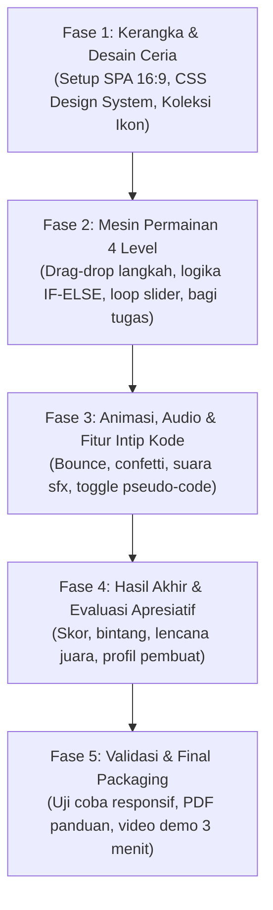

# 🍳 Chef Algorithm — Petualangan Masak Digital

## Gim Edukasi untuk Festival Biru Putih 2026

**Tagline:** *"Susun resep lezatmu, pahami rahasia komputasi di baliknya!"*

**Mata Pelajaran:** Informatika  
**Fase/Kelas:** Fase D (Kelas VII–IX SMP)  
**Elemen CP:** Algoritma & Pemrograman (AP) + Berpikir Komputasional (BK)  
**Kreator:** Chanif Fanani, S.Pd.  
**Inspirasi Karya Penyelenggara:** Mengadopsi prinsip desain dari karya resmi Kemendikdasmen (*Ular Tangga Edukasi*) — interaktif, visual ceria, kaya animasi & ikon, serta bahasa yang ramah orang awam.

---

## 🌟 Benchmark & Rujukan Resmi Penyelenggara

Sebagai acuan standar kualitas yang disukai juri dan penyelenggara lomba, rancangan gim ini menelaah dan mengadopsi kekuatan dari karya resmi Kemendikdasmen:  
🔗 **Rujukan:** `https://cdn.murid.kemendikdasmen.go.id/konten-interaktif/UlarTangga_1f4da2ba3531250a27f8353457180581/index.html`

### 💡 Poin-Poin Kunci yang Diadopsi:
1. **Penuh Ikon & Emoticon Visual (Icon-Rich UI):** Tidak ada tombol atau informasi yang hanya berupa teks kaku. Semua elemen dilengkapi ikon ekspresif (👨‍🍳, 🍳, 🔪, 🧂, 🍲, ⏱️, 🏆, ⭐, 💡, 📜) sehingga ramah anak dan menarik sejak detik pertama.
2. **Bahasa Ramah & Mudah Dipahami (Awam-Friendly):** Istilah komputasi disajikan secara kontekstual dengan padanan bahasa sehari-hari yang renyah dan santai, bukan jargon teoritis yang membosankan.
3. **Animasi Hidup & Dinamis (Lively Micro-Animations):**
   - Efek lentur/bounce saat menekan tombol dan memindahkan bahan.
   - Efek goyang (shake) lembut disertai tips penyemangat saat langkah belum tepat.
   - Efek partikel, uap panas berputar, kilauan bintang, dan hujan kembang api (confetti) saat berhasil menyelesaikan misi.
   - *Progress bar* dan indikator langkah dengan garis transisi warna dinamis.
4. **Alur Bertahap yang Rapi:** Setup profil/karakter chef yang menyenangkan ➔ Panduan ringkas ➔ Panggung game interaktif ➔ Modal kemenangan yang membanggakan.
5. **Feedback Audio-Visual Spontan:** Setiap sentuhan menghasilkan respons suara dan visual yang memuaskan (*satisfying click, sizzle, ding, fanfare*).

---

## 📋 Ketentuan Juknis yang Wajib Dipenuhi

### A. Definisi & Karakteristik (BAB III Juknis)

- Gim Edukasi = bahan ajar yang mengintegrasikan gamifikasi untuk mendukung pencapaian tujuan pembelajaran.
- Memiliki **alur penyelesaian misi (pathway)** yang jelas dan terstruktur dari awal hingga akhir.
- Terdapat **instruksi awal yang jelas**, **sistem skor/bintang**, dan **hasil akhir** apresiatif.
- Interaksi bervariasi: drag & drop bahan masak, percabangan interaktif, susun blok pengulangan, pembagian tugas asisten.

### B. Struktur & Komponen Wajib

| # | Komponen | Implementasi di Chef Algorithm |
|---|----------|--------------------------------|
| 1 | **Laman Muka** | Cover ceria: judul bernuansa dapur digital, profil chef, tujuan pembelajaran, tombol MULAI 🚀 |
| 2 | **Panduan Bermain** | Tutorial interaktif bergambar dengan bahasa sederhana & ilustrasi animasi |
| 3 | **Aktivitas/Misi** | 4 Level tantangan memasak kuliner Nusantara yang seru & bermakna |
| 4 | **Misi (Pathway)** | Peta jalur dapur bertahap: *Dapur Pemula* ➔ *Dapur Kafe* ➔ *Katering Pesta* ➔ *Dapur Restoran Bintang 5* |
| 5 | **Indikator Progres** | Level aktif, perolehan bintang (⭐), waktu tersisa (⏱️), dan status masakan |
| 6 | **Hasil Akhir** | Modal kemenangan meriah: skor akumulasi, lencana gelar Chef, ulasan konsep, dan tombol main lagi 🏆 |

### C. Mekanisme Permainan Wajib

| # | Aspek | Standar Juknis & Implementasi |
|---|-------|-------------------------------|
| 1 | **Minimal Tantangan** | ≥ 3 level (Disediakan **4 Level Misi Bertahap**) |
| 2 | **Jenis Gamifikasi** | Misi berbasis skenario nyata di dapur resto dengan tantangan waktu dan akurasi |
| 3 | **Mekanisme Dinamis** | Drag & drop bahan, sambung kartu logika, slider putaran porsi, dan manajemen tim |
| 4 | **Navigasi Intuitif** | Tombol selalu berlabel jelas dengan ikon, dapat mengulang level tanpa error |

### D. Umpan Balik & Reward Wajib

| # | Aspek | Standar Juknis & Implementasi |
|---|-------|-------------------------------|
| 1 | **Respons Instan** | Efek suara mendesis (sizzle), potongan pisau (chop), dan visual kompor menyala real-time |
| 2 | **Penghargaan** | Bintang emas (⭐ 1–3), piala pencapaian, gelar chef kehormatan |
| 3 | **Hasil Akhir** | Kartu rapor chef yang memotivasi + rangkuman fakta unik teknologi |

### E. Fungsionalitas & Format File (Kepatuhan Penuh)

| # | Aspek | Spesifikasi |
|---|-------|-------------|
| 1 | Format Aplikasi | HTML5 (SPA — Single Page Application) |
| 2 | Rasio Layar | **16:9** (Optimal di laptop/proyektor, tetap fleksibel di tablet & smartphone) |
| 3 | Kecepatan Muat | ≤ 3 detik (ringan, tanpa lag, bebas ketergantungan luar) |
| 4 | Dependensi | **100% Offline** (Hanya HTML, CSS, JavaScript lokal; font & ikon lokal/SVG; tanpa CDN) |
| 5 | Paket Pengumpulan | File .ZIP ≤ 150 MB (Target sangat ringkas: < 20 MB) |
| 6 | Dokumen Pendukung | Panduan Penggunaan (PDF) + Video Demo Gameplay (MP4 ≤ 3 Menit) — **WAJIB** |

---

## 🗣️ Glosarium Istilah: Dari Konsep Kaku Menjadi Bahasa Akrab

Agar gim terasa **menyenangkan, ramah anak, dan mudah dipahami orang awam**, seluruh istilah komputasi disajikan dalam dua lapisan: bahasa sehari-hari saat bermain, dan bahasa keilmuan saat sesi ulasan konsep.

| Istilah Kaku Informatika | Bahasa Akrab di Gim (Mudah Dipahami) | Penjelasan Simpel untuk Siswa/Orang Awam |
|--------------------------|--------------------------------------|-----------------------------------------|
| **Algoritma Sekuensial** | 📋 **Langkah Berurutan (Resep Rapi)** | Memasak harus runtut satu per satu. Kalau bumbu belum ditumis tapi nasi sudah masuk, rasanya jadi aneh! |
| **Logika Kondisional (IF-ELSE)** | 🔀 **Pilihan Selera (Jika ... Maka ...)** | Menyesuaikan masakan dengan pesanan tamu. *JIKA* tamu vegetarian, *MAKA* ganti daging dengan tahu gurih! |
| **Perulangan (Looping / Iterasi)** | 🔁 **Putaran Kilat (Otomatis & Cepat)** | Memasak 10 porsi tidak perlu menulis resep 10 kali. Cukup gunakan perintah: *Ulangi 10 kali*! |
| **Dekomposisi Masalah** | 🧩 **Bagi Tugas (Kerja Bareng Tim)** | Mengerjakan pesanan besar sekaligus itu bikin pusing. Pecah jadi tugas kecil: satu orang cuci, satu potong, satu masak! |
| **Debugging / Error Handling** | 🔍 **Cek Resep & Perbaiki Masakan** | Mencari tahu mengapa masakan gosong atau tumpah, lalu membetulkan urutan yang keliru! |

---

## 🎮 Rancang Bangun 4 Misi Permainan

Setiap misi mengombinasikan visual dapur interaktif di sisi kiri dengan panel instruksi dan aksi di sisi kanan (gaya split-screen 16:9 yang rapi).

```
+-----------------------------------------------------------------------------------+
| 👨‍🍳 CHEF ALGORITHM    [Level 1: Nasi Goreng Juara]   ⭐ ⭐ ⭐   ⏱️ 01:45   🔊 [ON] |
+---------------------------------------------------+-------------------------------+
|                                                   | 📋 PANEL MISI & INSTRUKSI     |
|             PANGGUNG DAPUR INTERAKTIF             |                               |
|                                                   | "Yuk susun langkah memasak    |
|   +-------------------------------------------+   |  nasi goreng yang benar!"     |
|   |  🍳 Kompor & Wajan (Animasi Uap & Api)     |   |                               |
|   |                                           |   | 💡 Tips Chef:                 |
|   |  [ Slot 1 ] -> [ Slot 2 ] -> [ Slot 3 ]   |   | Tumis bumbu dulu sebelum      |
|   |                                           |   | memasukkan nasi ya!           |
|   +-------------------------------------------+   |                               |
|                                                   | 🔘 [ Cek Masakan 🍳 ]         |
|   Bahan & Aksi (Dapat Digeser/Diklik):            | 🔍 [ Intip Kode Rahasia 💻 ]  |
|   [ 🧅 Bumbu ] [ 🍚 Nasi ] [ 🔪 Potong ]         |                               |
|   [ 🍳 Tumis ] [ 🍽️ Piring ]                     | 📜 Catatan Masak:             |
|                                                   | > Bumbu sudah disiapkan...    |
+---------------------------------------------------+-------------------------------+
```

---

### Misi 1: 🥉 Nasi Goreng Juara — "Langkah Berurutan"
- **Tantangan:** Menyusun kartu aksi memasak ke atas meja saji sesuai urutan yang logis.
- **Pilihan Kartu:** 
  1. 🧽 Cuci bahan bersih-bersih
  2. 🔪 Iris bawang & cabai
  3. 🍳 Panaskan wajan & tumis bumbu
  4. 🍚 Masukkan nasi putih
  5. 🥄 Aduk hingga matang merata
  6. 🍽️ Sajikan di atas piring hangat
- **Interaksi & Animasi:** 
  - Drag atau klik kartu ke slot bernomor.
  - Kartu bergeser dengan efek halus (smooth spring).
  - Saat tombol *Cek Masakan* ditekan, wajan mendesis `psssshhh~`, api kompor menyala ceria, dan uap harum mengepul.
  - Jika urutan salah (misal: nasi dimasukkan sebelum wajan dipanaskan), muncul karakter chef tersenyum bingung: *"Aduh, wajannya masih dingin, nasinya belum matang! Yuk tukar urutannya!"* (Kartu yang keliru bergetar lembut merah).
- **Apresiasi & Edukasi:**
  - Bintang emas ⭐⭐⭐ jika berhasil dalam 1–2 kali percobaan.
  - Ulasan Singkat: *"Hebat! Kamu baru saja menyusun sebuah **Algoritma Sekuensial**, yaitu runtunan langkah yang harus dilakukan berurutan agar hasilnya sukses!"*

---

### Misi 2: 🥈 Sup Ayam atau Tahu? — "Pilihan Selera (Jika-Maka)"
- **Tantangan:** Menyiapkan pesanan pelanggan yang datang silih berganti dengan selera berbeda.
- **Skenario Pelanggan:**
  - 👦 *Tamu 1:* "Saya mau sup ayam hangat, banyak sayurnya!"
  - 👧 *Tamu 2:* "Saya vegetarian, tidak boleh ada daging sama sekali!"
  - 🧓 *Tamu 3:* "Porsinya sedikit saja ya, lagi diet!"
- **Interaksi & Animasi:**
  - Papan logika bercabang visual berbentuk jalur garpu lucu dengan ikon:  
    `❓ Cek Tamu ➔ [ JIKA Vegetarian ] ➔ 🥣 Tahu Sutra | [ JIKA TIDAK ] ➔ 🍗 Daging Ayam`
  - Siswa mengarahkan sakelar jalur rel bahan makanan menuju mangkuk pelanggan.
  - Tamu tersenyum lebar dan memberikan jempol 👍 jika mangkuk sup sesuai dengan preferensinya.
- **Apresiasi & Edukasi:**
  - Ulasan Singkat: *"Keren! Komputer di HP-mu juga berpikir seperti ini. Contohnya saat membuka kunci layar: **JIKA** password benar ➔ **MAKA** layar terbuka, **JIKA TIDAK** ➔ muncul peringatan salah!"*

---

### Misi 3: 🥇 Katering 20 Kotak — "Putaran Kilat (Ulangi/Loop)"
- **Tantangan:** Ada pesanan mendadak untuk 20 kotak bekal sekolah. Tidak mungkin menyusun 20 kali resep satu per satu!
- **Interaksi & Animasi:**
  - Siswa menggunakan tuas putaran ajaib bertuliskan:  
    `🔁 ULANGI SEBANYAK [ 10 ] KALI ➔ [ 🍱 Masukkan Lauk & Nasi ]`
  - Siswa menyesuaikan angka target dengan tombol plus/minus (`➕` / `➖`).
  - Animasi konveyor katering berjalan cepat: kotak-kotak makanan terisi secara otomatis satu demi satu disertai bunyi denting gembira (*ting-ting-ting!*).
  - Penghitung kotak bertambah dari 1 sampai 20 dengan bar progres warna-warni.
- **Apresiasi & Edukasi:**
  - Ulasan Singkat: *"Bayangkan kalau harus klik 20 kali! Dengan **Perulangan (Loop)**, cukup satu perintah dan sistem akan mengerjakan sisanya dengan kilat tanpa lelah."*

---

### Misi 4: 🏆 Restoran Bintang 5 — "Bagi Tugas Tim (Dekomposisi)"
- **Tantangan:** Jam makan siang tiba! Ada 3 pesanan sekaligus: Nasi Goreng, Es Teh Manis, dan Pisang Goreng Keju. Waktu hanya 60 detik!
- **Interaksi & Animasi:**
  - Ada 3 meja kerja dengan 3 koki asisten:
    - 👨‍🍳 *Koki Andi (Spesialis Potong & Cuci)*
    - 👩‍🍳 *Koki Siti (Spesialis Masak Kompor)*
    - 🧑‍🍳 *Koki Budi (Spesialis Minuman & Penyajian)*
  - Siswa membagi kartu tugas ke masing-masing asisten dengan tepat agar semua pesanan selesai berbarengan sebelum waktu habis.
  - Timer bar dinamis berubah warna (Hijau ➔ Kuning ➔ Oranye ➔ Merah) diiringi detak jam yang memacu semangat.
- **Apresiasi & Edukasi:**
  - Ulasan Singkat: *"Masalah besar jadi terasa ringan saat kita **Dekomposisi** (pecah jadi bagian-bagian kecil) dan dikerjakan bersama. Begitulah cara programmer membuat aplikasi raksasa seperti game dan media sosial!"*

---

## 🔍 Fitur Unggulan: "Mode Intip Kode Rahasia" 💻

Di setiap level, siswa dan juri dapat menekan tombol **"🔍 Intip Kode Rahasia"** kapan saja. Fitur ini membuka laci interaktif yang menampilkan bagaimana aksi masak diterjemahkan ke dalam bahasa logika komputasi sederhana:

```
// Resep Masakmu Versi Komputer:
MULAI
  Siapkan wajan
  Tumis(bumbu, minyak)
  Masukkan(nasi_putih)
  JIKA rasa == "kurang asin" MAKA
    Tambahkan(garam)
  Sajikan(di_piring)
SELESAI
```

> **Keunggulan untuk Penilaian:** Fitur ini menjamin bahwa unsur **Akurasi Keilmuan (15%)** dan **Kedalaman Materi (10%)** tetap terpancar kuat di hadapan dewan juri, tanpa sedikit pun mengurangi kesenangan siswa saat bermain.

---

## 🎨 Panduan Visual, Ikon & Desain Audio

### 1. Palet Warna Ceria & Menyenangkan
- **Warna Utama (Dapur & Kehangatan):** `#FF6B35` (Oranye ceria) & `#F7C948` (Kuning keemasan)
- **Warna Aksen & Sukses:** `#2ECC71` (Hijau mint segar)
- **Warna Perhatian & Timer:** `#E63946` (Merah cabai)
- **Warna Latar & Kartu:** `#FFFDF9` (Krem bersih) & `#2C3E50` (Navy lembut untuk teks kontras tinggi)

### 2. Pustaka Ikon & Emoticon yang Melimpah
- **Status & Navigasi:** 🏠 (Beranda), ▶️ (Mulai), 🔄 (Ulangi), ⏭️ (Lanjut), 💡 (Petunjuk), ⚙️ (Pengaturan), 🔊 (Suara Aktif), 🔇 (Hening)
- **Karakter & Emosi:** 👨‍🍳 (Chef Utama), 👩‍🍳 (Asisten), 😋 (Puas/Enak), 🤔 (Berpikir), 🥳 (Menang)
- **Bahan & Alat:** 🍳, 🥣, 🔪, 🥄, 🍚, 🍗, 🧅, 🧄, 🥕, 🧂, 🍱, 🍽️
- **Prestasi:** ⭐ (Bintang Emas), 🏆 (Piala Juara), 🎖️ (Lencana Kehormatan), 🎉 (Perayaan)

### 3. Efek Suara (Web Audio API Berbasis Sintesis Lokal / File Ringan)
- `click.mp3` ➔ Suara ketukan tombol empuk & renyah.
- `chop.mp3` ➔ Suara pisau memotong bahan (*tuk-tuk-tuk*).
- `sizzle.mp3` ➔ Suara bumbu masuk wajan panas.
- `correct.mp3` ➔ Denting ceria nada mayor saat jawaban tepat.
- `wrong.mp3` ➔ Suara dengung bersahabat (tidak mengejutkan) mengajak mencoba lagi.
- `fanfare.mp3` ➔ Nada terompet kemenangan di akhir misi.

---

## 🏆 Halaman Hasil Akhir & Apresiasi Prestasi

Setelah menyelesaikan seluruh rangkaian misi, pemain disambut dengan **Layar Pesta Juara**:
1. **Animasi Kemenangan:** Hujan konfeti warna-warni dan chef melompat gembira.
2. **Kartu Gelar Chef:**
   - 🌟 Skor 900–1000: *"Master Chef Komputasi"*
   - ⭐ Skor 750–899: *"Chef Handal Algoritma"*
   - ✨ Skor < 750: *"Chef Bintang Berbakat"*
3. **Papan Rangkuman:**
   - Total Bintang yang Dikumpulkan (Maksimal 12 ⭐)
   - Waktu Penyelesaian Keseluruhan
   - Daftar 4 Konsep Hebat yang Berhasil Dikuasai
4. **Tombol Interaktif:**
   - 🔄 *Main Lagi & Tingkatkan Skor*
   - 📜 *Lihat Rapor Belajar & Fakta Unik*
   - 👨‍💻 *Profil Pengembang*

---

## 🗺️ Rencana Implementasi Bertahap



---

## ✅ Checklist Kepatuhan & Keunggulan Gim

- [x] Sesuai tema dan kriteria Juknis Festival Biru Putih 2026
- [x] Mengadopsi kekuatan karya resmi penyelenggara Kemendikdasmen (*Ular Tangga Edukasi*)
- [x] Penuh dengan ikon ekspresif di setiap sudut antarmuka
- [x] Animasi mikro yang hidup, halus, dan memuaskan
- [x] Bahasa sangat ramah, hangat, dan mudah dipahami orang awam
- [x] Konsep komputasi tetap akurat melalui fitur *Intip Kode Rahasia*
- [x] 100% mandiri secara teknis (offline, tanpa dependensi CDN eksternal)
- [x] Siap dikemas dalam paket rapi beserta panduan PDF dan video demo
