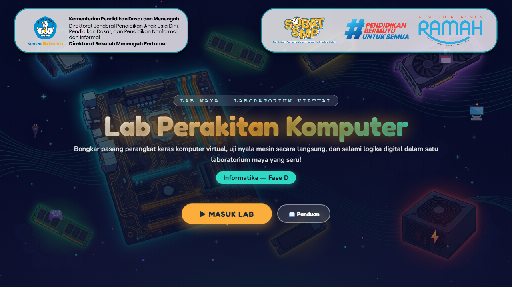
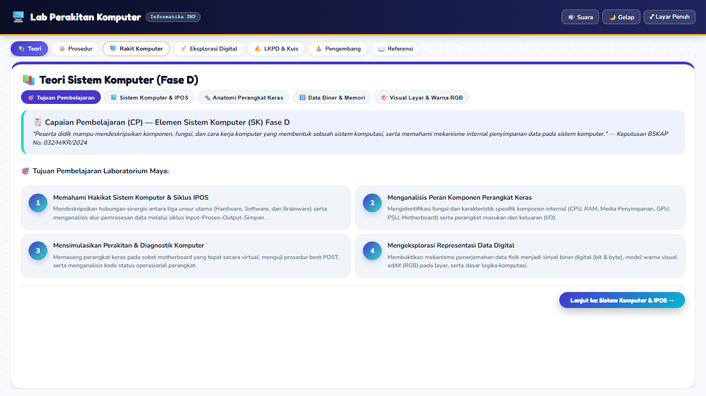
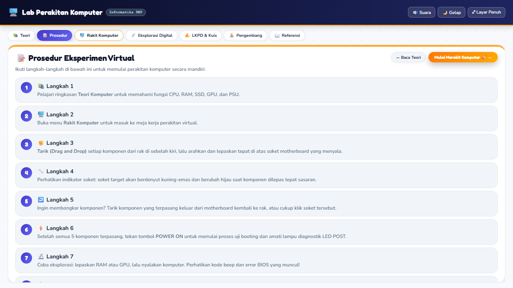
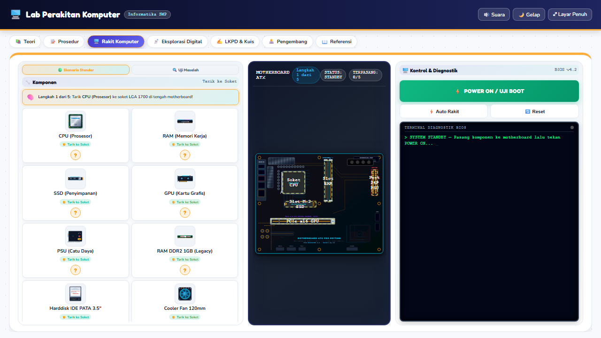
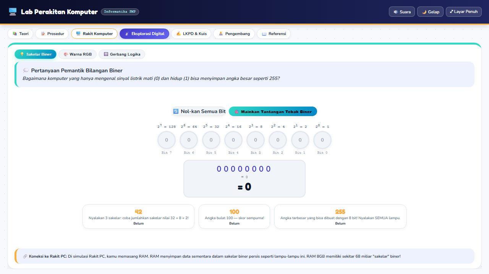
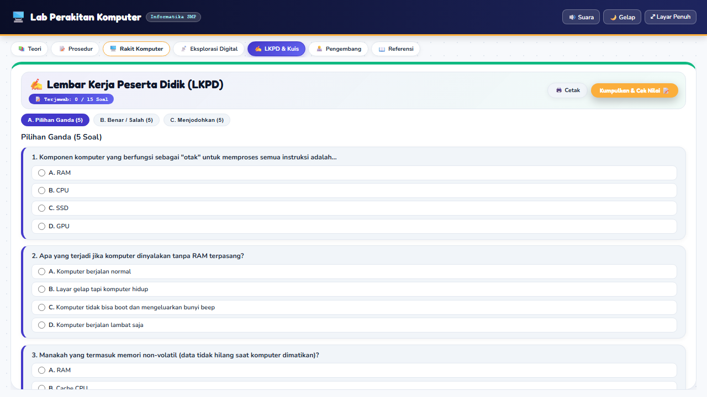

# BUKU PANDUAN PENGGUNAAN & DESKRIPSI TEKNIS (USER GUIDE)
**KATEGORI SAYEMBARA: LAB MAYA (FESTIVAL BIRU PUTIH 2026)**  
**KEMENTERIAN PENDIDIKAN DASAR DAN MENENGAH — DIREKTORAT SMP**  

---

### Judul Karya
**LABORATORIUM MAYA SISTEM KOMPUTER: SIMULASI PERAKITAN PC, DIAGNOSTIK HARDWARE & LOGIKA DIGITAL**

### Identitas Pengembang & Karya
| Parameter | Informasi Resmi Pengembang |
| :--- | :--- |
| **Nama Lengkap** | Ach. Chanifuddin Fanani, S.Pd. |
| **NIP** | 199108262020121007 |
| **NUPTK** | 9158769670130183 |
| **NIK** | 3524162608910001 |
| **Instansi / Unit Kerja** | SMP Negeri 2 Lamongan |
| **Kabupaten / Provinsi** | Kabupaten Lamongan, Jawa Timur |
| **No. Telepon / WhatsApp** | 08158885508 |
| **Alamat Surel (Email)** | chanifuddin@gmail.com |
| **Portofolio Web** | [https://fanani.my.id](https://fanani.my.id) |
| **Sasaran Pengguna** | Peserta Didik SMP Fase D (Kelas VII/VIII/IX) |

---

## BAB I. LATAR BELAKANG & RASIONAL INOVASI

### 1.1 Latar Belakang Masalah
Pembelajaran Informatika pada jenjang Sekolah Menengah Pertama (SMP), khususnya pada elemen Sistem Komputer (SK), sering kali dihadapkan pada kendala mendasar terkait ketersediaan dan keamanan sarana praktikum. Perangkat keras komputer fisik (hardware) merupakan aset laboratorium yang mahal dan sangat rentan terhadap kerusakan fisik elektro-mekanik. Komponen sensitif seperti pin soket prosesor LGA, kepingan memori RAM DDR4 yang rentan terhadap lucutan elektrostatik (*Electrostatic Discharge* / ESD), serta risiko hubungan arus pendek daya (*short circuit*) menyebabkan guru enggan atau tidak mengizinkan peserta didik untuk membongkar-pasang unit komputer fisik yang berfungsi.

Dampaknya, pembelajaran materi perakitan komputer dan arsitektur sistem kerap tereduksi menjadi sekadar ceramah teoritis satu arah atau penayangan video pasif. Peserta didik kehilangan kesempatan emas untuk merasakan pengalaman langsung (*hands-on experience*), mengasah keterampilan pemecahan masalah (*troubleshooting*), serta membangun intuisi logis mengenai kompatibilitas perangkat keras dan sistem booting komputer.

### 1.2 Solusi Inovasi Berbasis Lab Maya
Menjawab tantangan tersebut, dikembangkan karya **"Lab Maya Sistem Komputer: Perakitan PC, Diagnostik Hardware & Logika Digital"**. Media ini dirancang sebagai laboratorium virtual berbasis peramban (*Single Page Application*) yang menyediakan representasi interaktif, presisi, dan aman dari arsitektur komputer modern. Peserta didik dapat bereksperimen membongkar dan merakit PC secara virtual, menguji skenario inkompatibilitas komponen tanpa risiko kerusakan fisik, menyaksikan proses booting BIOS dan *Power-On Self-Test* (POST) secara visual-auditori, hingga menjelajahi logika digital abstrak (bit biner, pencampuran warna RGB 24-bit, dan gerbang logika).

> **📌 Visi Pembelajaran:** Lab Maya ini hadir sebagai jembatan pemerataan mutu pendidikan digital, memungkinkan setiap sekolah di seluruh pelosok Indonesia menyelenggarakan praktikum perakitan komputer standar industri secara gratis, aman, dan 100% luring (*offline*).

---

## BAB II. PEMETAAN KURIKULUM & CAPAIAN PEMBELAJARAN

Karya ini dikembangkan dengan rujukan ketat pada **Keputusan Kepala BSKAP Kemendikbudristek No. 032/H/KR/2024** tentang Capaian Pembelajaran pada Pendidikan Anak Usia Dini, Jenjang Pendidikan Dasar, dan Jenjang Pendidikan Menengah.

### 2.1 Capaian Pembelajaran (Fase D — Elemen Sistem Komputer)
> *"Pada akhir fase D, peserta didik mampu mendeskripsikan komponen, fungsi, dan cara kerja komputer yang membentuk sebuah sistem komputasi, serta menjelaskan proses dan penggunaan kodifikasi data (biner, warna RGB) dalam sistem komputer."*

### 2.2 Tujuan Pembelajaran (TP) & Alur Ketercapaian
1. **TP-01 (Identifikasi Hardware):** Peserta didik mampu mengidentifikasi dan membedakan komponen penyusun unit pemrosesan komputer (CPU, Motherboard, RAM, SSD NVMe, GPU, PSU) beserta karakteristik dan spesifikasi fisiknya.
2. **TP-02 (Prosedur Perakitan):** Peserta didik mampu menyimulasikan prosedur perakitan komputer secara runtut, presisi, dan sesuai standar keselamatan kerja perakitan (K3 elektronika).
3. **TP-03 (Diagnostik & Troubleshooting):** Peserta didik mampu menganalisis kegagalan perakitan, mendeteksi inkompatibilitas komponen (distraktor soket/arsitektur), dan membaca kode diagnostik LED POST BIOS.
4. **TP-04 (Logika Digital & Kodifikasi):** Peserta didik mampu membuktikan secara empiris konsep representasi data biner 8-bit, pencampuran warna piksel monitor 24-bit RGB, serta operasi tabel kebenaran gerbang logika dasar.

### 2.3 Penguatan Profil Pelajar Pancasila
- **Bernalar Kritis:** Mengidentifikasi kesalahan pemasangan komponen, menganalisis gejala kegagalan boot, dan memecahkan teka-teki logika digital.
- **Mandiri:** Melakukan eksplorasi mandiri di laboratorium virtual dengan tempo belajar yang disesuaikan dengan kebutuhan individu peserta didik.
- **Kreatif:** Mengombinasikan kombinasi warna RGB dan merancang alur logika input gerbang logika.

---

## BAB III. PERSYARATAN SISTEM & PETUNJUK OPERASIONAL

### 3.1 Persyaratan Perangkat Keras & Lunak
- **Perangkat Keras (Hardware):** PC / Laptop dengan prosesor dual-core (minimal 1.5 GHz), RAM 2 GB, monitor resolusi 1280x720 (atau rasio 16:9 lainnya), mouse / touchpad, dan speaker / headphone aktif.
- **Perangkat Lunak (Software):** Sistem Operasi Windows 7/8/10/11, macOS, Linux, atau ChromeOS. Peramban web modern (Google Chrome, Microsoft Edge, Mozilla Firefox, atau Opera) dengan dukungan HTML5 Canvas dan Web Audio API.
- **Konektivitas Jaringan:** Aplikasi bersifat **100% mandiri (*stand-alone*) luring**. Tidak memerlukan sambungan internet, instalasi server lokal (XAMPP/Node.js), maupun plugin tambahan.

### 3.2 Langkah Menjalankan Media
1. Ekstrak folder karya jika berada dalam arsip ZIP.
2. Buka folder dan temukan berkas utama bernama `index.html`.
3. Klik ganda berkas `index.html` atau klik kanan lalu pilih *Open with Google Chrome / Microsoft Edge*.
4. Aplikasi akan langsung terbuka dalam waktu kurang dari 1 detik dan siap digunakan.

---

## BAB IV. PANDUAN PENGGUNAAN FITUR & TANGKAPAN LAYAR

### 1. Layar Pembuka (Welcome Screen)
  
*Gambar 1: Layar Pembuka (Welcome Screen) Lab Maya Perakitan Komputer*

| Penanda / Bagian UI | Deskripsi Fungsi & Interaksi Pengguna |
| :--- | :--- |
| **1. Header & Logo** | Menampilkan identitas kementerian, logo Tut Wuri Handayani, dan judul aplikasi dengan estetika futuristik. |
| **2. Badge Fase D** | Penanda jenjang kurikulum Informatika SMP Fase D untuk memudahkan orientasi guru dan siswa. |
| **3. Tombol ▶ MASUK LAB** | Memicu transisi animasi membuka ruang meja kerja laboratorium virtual dan mengaktifkan Web Audio API. |
| **4. Tombol 📖 Panduan** | Membuka jendela modal petunjuk ringkas keselamatan kerja dan navigasi alat lab. |

---

### 2. Modul Teori Interaktif & Ensiklopedia Komponen
  
*Gambar 2: Modul Teori Interaktif & Ensiklopedia Komponen Hardware*

| Penanda / Bagian UI | Deskripsi Fungsi & Interaksi Pengguna |
| :--- | :--- |
| **1. Tab Navigasi Skenario** | Bilah menu horizontal fleksibel untuk berpindah antar modul (Teori, Prosedur, Rakit PC, Eksplorasi, LKPD). |
| **2. Kartu Komponen Hardware** | Menampilkan visualisasi 3D-styled, fungsi utama, spesifikasi, dan peran masing-masing komponen dalam siklus data. |
| **3. Tooltips Edukatif** | Arahkan kursor mouse ke setiap kartu untuk melihat rincian soket, kecepatan transfer, dan peran arsitekturnya. |

---

### 3. Modul Prosedur & K3 Perakitan Komputer
  
*Gambar 3: Modul Prosedur Standar & K3 Perakitan Komputer*

| Penanda / Bagian UI | Deskripsi Fungsi & Interaksi Pengguna |
| :--- | :--- |
| **1. Infografis K3 Elektronika** | Pedoman penggunaan gelang antistatis, pembuangan muatan statis tubuh, dan penggunaan obeng bertip magnetik. |
| **2. Runtutan SOP 5 Tahap** | Urutan logis perakitan: (1) CPU, (2) RAM, (3) SSD M.2, (4) GPU PCIe, hingga (5) Kabel Daya 24-Pin ATX. |
| **3. Peringatan Keselamatan** | Instruksi visual hal-hal yang dilarang keras, seperti menyentuh pin emas CPU atau memaksa modul memori terbalik. |

---

### 4. Meja Kerja Perakitan PC Interaktif (Simulasi Inti)
  
*Gambar 4: Meja Kerja Perakitan PC Interaktif (Simulasi Inti)*

| Penanda / Bagian UI | Deskripsi Fungsi & Interaksi Pengguna |
| :--- | :--- |
| **1. Stepper Panduan Dinamis** | Indikator langkah aktif (Langkah 1 dari 5) yang secara adaptif memandu komponen target yang harus dipasang. |
| **2. Rak Komponen Interaktif** | Daftar komponen yang siap diseret (*drag-and-drop*) menuju soket target pada motherboard. |
| **3. Toggle Mode Skenario** | Pilihan antara '🟢 Skenario Standar' (kompatibel) dan '🔍 Uji Masalah' (menguji komponen distraktor yang salah). |
| **4. Kanvas Motherboard ATX** | Papan induk interaktif dengan drop-zone bersinar (*highlight*) saat komponen yang sesuai diarahkan mendekati soket. |
| **5. Panel Diagnostik & Tombol Boot** | Tombol '⚡ POWER ON / UJI BOOT' dan 4 lampu LED indikator (CPU, DRAM, VGA, BOOT) untuk menyimulasikan POST BIOS. |

---

### 5. Wahana Eksplorasi Digital
  
*Gambar 5: Wahana Eksplorasi Digital (Biner, RGB 24-Bit & Gerbang Logika)*

| Penanda / Bagian UI | Deskripsi Fungsi & Interaksi Pengguna |
| :--- | :--- |
| **1. Sakelar Biner 8-Bit** | 8 sakelar toggle (bit 0-7) dengan perhitungan nilai desimal real-time dan kuis tebak angka interaktif. |
| **2. Simulator Warna RGB 24-Bit** | Tiga slider interaktif Red (0-255), Green (0-255), Blue (0-255) yang menghasilkan visualisasi warna dan kode HEX (#RRGGBB). |
| **3. Laboratorium Gerbang Logika** | Simulasi interaktif 6 gerbang (AND, OR, NOT, XOR, NAND, NOR) dilengkapi tabel kebenaran dinamis. |

---

### 6. Modul LKPD Digital & Kuis Formatif
  
*Gambar 6: Modul LKPD Digital & Kuis Evaluasi Formatif*

| Penanda / Bagian UI | Deskripsi Fungsi & Interaksi Pengguna |
| :--- | :--- |
| **1. Lembar Kerja Peserta Didik** | Penugasan terstruktur yang mencakup identifikasi bagian, analisa kasus kerusakan, dan penalaran teknis. |
| **2. Sistem Kuis Interaktif** | Evaluasi pilihan ganda berbasis stimulus dengan umpan balik langsung (pembahasan ilmiah seketika). |
| **3. Rekap Skor & Pencetakan Nilai** | Sistem kalkulasi nilai otomatis yang dapat dicetak atau disimpan sebagai arsip portofolio siswa. |

---

## BAB V. FITUR PEDAGOGIS & INTERAKTIVITAS KHUSUS

### 5.1 Scaffolding Pembelajaran Bertahap
Lab Maya ini menerapkan scaffolding kognitif melalui panduan indikator langkah adaptif (*Langkah 1 dari 5*). Peserta didik yang baru pertama kali merakit komputer tidak akan merasa kewalahan karena sistem memberikan petunjuk visual yang jelas, drop-zone dengan highlight berkilau, dan pesan bimbingan kontekstual.

### 5.2 Umpan Balik Instan & Konstruktif (*Immediate Educational Feedback*)
Setiap interaksi pengguna langsung direspons dengan umpan balik multi-indera (visual dan audio):
- **Pemasangan Benar:** Komponen mengunci sempurna pada soket motherboard disertai efek suara mekanis klik presisi dan notifikasi konfirmasi hijau.
- **Pemasangan Salah / Distraktor:** Komponen kembali ke rak semula disertai getaran visual (*shake animation*), nada peringatan lembut, dan pesan edukatif yang menjelaskan mengapa komponen tersebut tidak cocok pada soket target.

### 5.3 Eksplorasi Skenario Masalah (*Troubleshooting Mode*)
Sesuai amanat Juknis mengenai pentingnya fitur eksplorasi berbagai skenario, media ini menyediakan tombol **'🔍 Uji Masalah'**. Dalam mode ini, peserta didik disajikan komponen distraktor seperti RAM DDR2 lama atau Harddisk antarmuka IDE purba. Jika siswa mencoba memasangnya, sistem menampilkan dialog diagnostik yang menjelaskan ketidaksesuaian fisik (perbedaan notch RAM) dan perbedaan generasi teknologi.

---

## BAB VI. ARSITEKTUR TEKNIS & KEPATUHAN JUKNIS

1. **Arsitektur Single Page Application (SPA):** Seluruh media dirangkum dalam arsitektur SPA yang berjalan mulus tanpa reload halaman, menghasilkan transisi antar modul yang instan dan bebas lag.
2. **Zero External CDN & Dependensi Mandiri:** Aplikasi beroperasi 100% secara offline. Seluruh jenis huruf lokal (Fredoka, Nunito, Poppins) dan pustaka ikon telah diunduh dan disimpan di direktori internal `assets/fonts/`.
3. **Web Audio Synthesis Engine:** Tidak mengandalkan rekaman audio MP3/WAV eksternal yang membebani memori, melainkan memanfaatkan Web Audio API bawaan peramban untuk menghasilkan frekuensi nada sintetis (beep BIOS, klik tombol, nada peringatan).
4. **Efisiensi Ukuran Berkas:** Total ukuran direktori karya hanya berkisar 4,5 MB, sangat jauh di bawah batas maksimum Juknis (150 MB), sehingga sangat ringan untuk didistribusikan ke komputer sekolah berspesifikasi terbatas.
5. **Rasio Layar 16:9 Adaptif:** Tampilan responsif dengan mempertahankan rasio aspek standar layar 16:9, menjamin keterbacaan optimal pada proyektor kelas, monitor PC lab, maupun layar laptop.

---

## BAB VII. GLOSARIUM & REFERENSI
- **CPU:** *Central Processing Unit*, otak utama komputer yang mengeksekusi instruksi program melalui siklus fetch-decode-execute.
- **Motherboard:** Papan sirkuit cetak utama tempat seluruh komponen hardware terhubung dan berkomunikasi satu sama lain.
- **RAM:** *Random Access Memory*, memori utama komputer berkecepatan tinggi yang bersifat volatile (data hilang saat listrik padam).
- **SSD NVMe M.2:** *Solid State Drive* dengan antarmuka *Non-Volatile Memory Express* yang terpasang pada slot M.2 dengan kecepatan transfer gigabit per detik.
- **POST BIOS:** *Power-On Self-Test*, rutinitas diagnostik yang dijalankan firmware BIOS saat komputer pertama kali dinyalakan untuk memeriksa kesiapan hardware.
