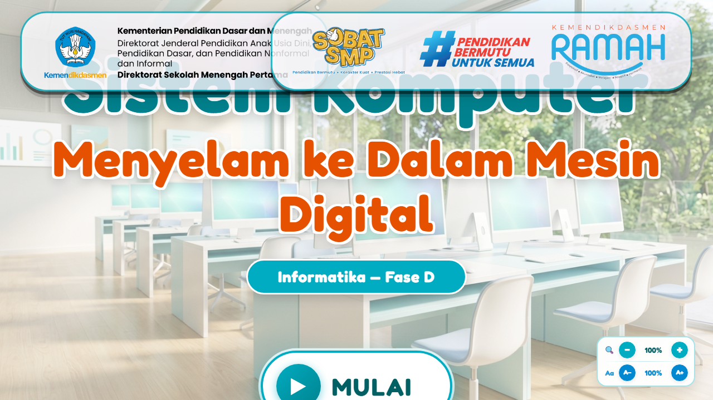
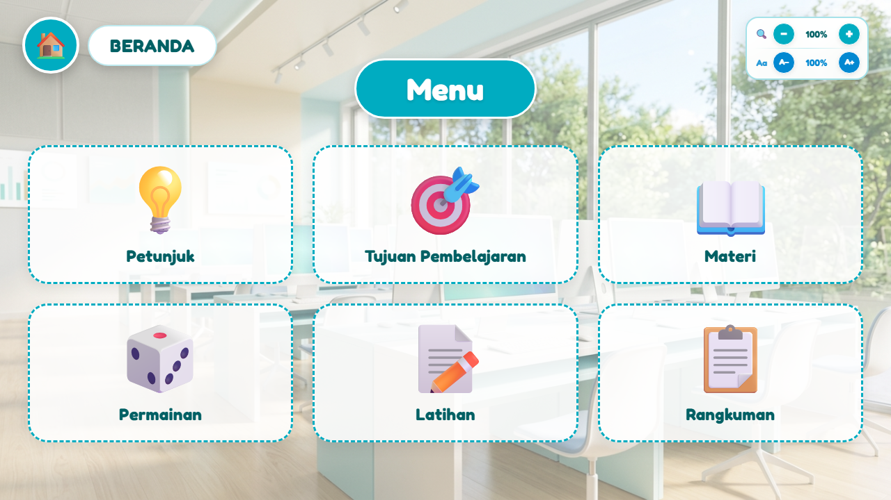
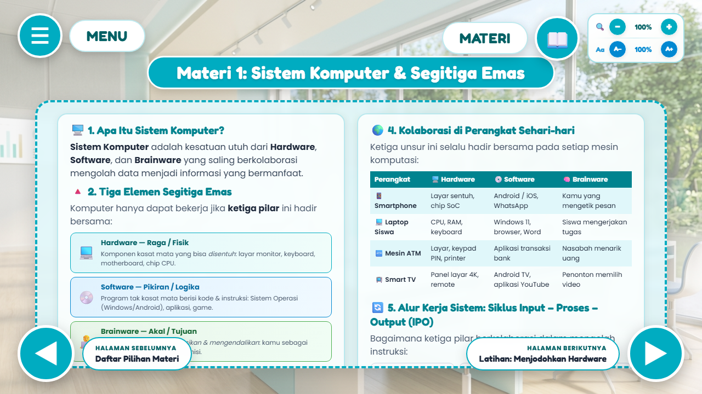
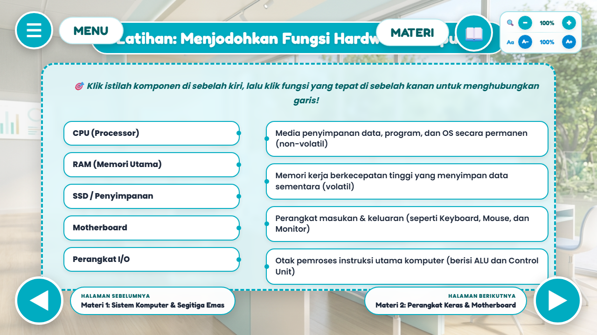
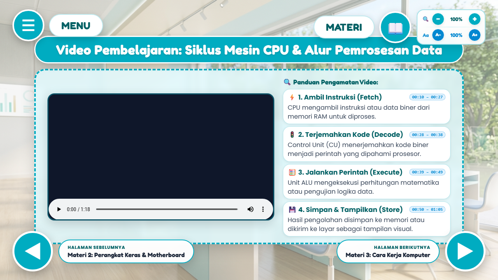
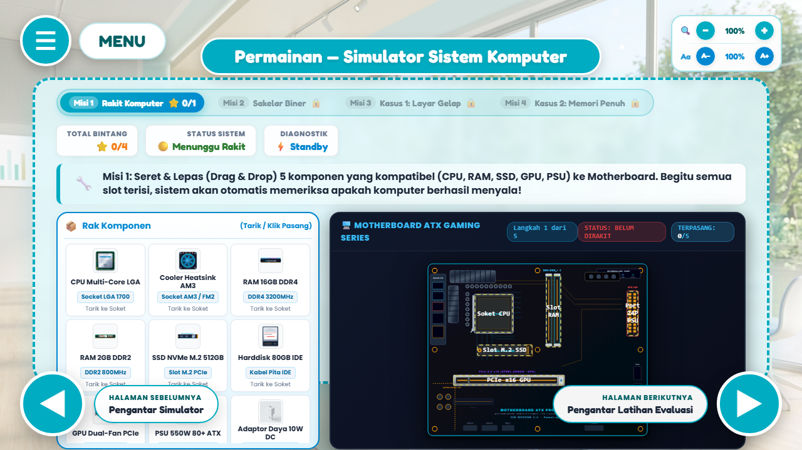
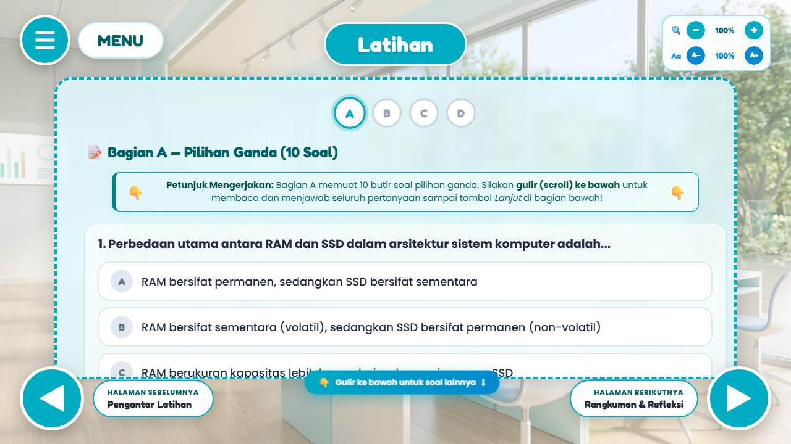
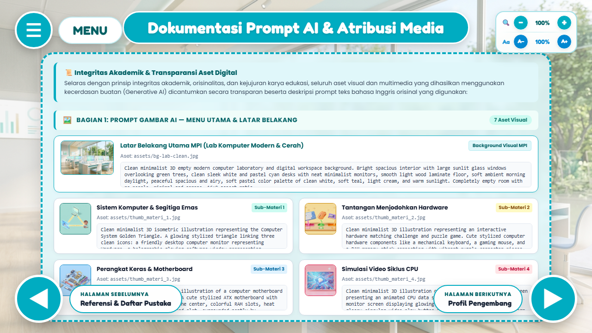

# BUKU PANDUAN PENGGUNAAN & DESKRIPSI TEKNIS (USER GUIDE)
**KATEGORI SAYEMBARA: MEDIA PEMBELAJARAN INTERAKTIF (BAB IV JUKNIS FESTIVAL BIRU PUTIH 2026)**  
**DIREKTORAT SEKOLAH MENENGAH PERTAMA — KEMENTERIAN PENDIDIKAN DASAR DAN MENENGAH**  

---

### Judul Karya
**MEDIA PEMBELAJARAN INTERAKTIF (MPI): MENYELAM KE DALAM MESIN DIGITAL — SISTEM KOMPUTER**

### Identitas Pengembang & Karya
| Parameter | Informasi Resmi Pengembang |
| :--- | :--- |
| **Nama Lengkap** | Ach. Chanifuddin Fanani, S.Pd. |
| **NIP** | 199108262020121007 |
| **NUPTK** | 9158769670130183 |
| **NIK** | 3524162608910001 |
| **Instansi / Unit Kerja** | SMP Negeri 2 Lamongan |
| **Kabupaten / Provinsi** | Kabupaten Lamongan, Jawa Timur |
| **No. Telepon / WhatsApp** | 08158885508 |
| **Alamat Surel (Email)** | chanifuddin@gmail.com |
| **Portofolio Web** | [https://fanani.my.id](https://fanani.my.id) |
| **Kategori Karya** | Media Pembelajaran Interaktif (Bab IV Juknis Festival Biru Putih 2026) |
| **Sasaran Pengguna** | Peserta Didik SMP Fase D (Kelas VII/VIII/IX) & Pendidik Informatika |

---

## BAB I. LATAR BELAKANG & RASIONAL INOVASI

### 1.1 Latar Belakang Masalah
Di era transformasi kecerdasan digital dan implementasi Kurikulum Merdeka, pemahaman tentang bagaimana sebuah komputer memproses data bukan lagi sekadar pengetahuan teoritis, melainkan kecakapan fundamental berpikir komputasional. Pada mata pelajaran Informatika jenjang SMP (Fase D), elemen Sistem Komputer (SK) menuntut peserta didik untuk memahami interaksi antara perangkat keras (*hardware*), perangkat lunak (*software*), dan pengguna (*brainware*), serta bagaimana data diproses dalam unit pemrosesan pusat (CPU).

Akan tetapi, materi ini kerap kali menjadi salah satu materi yang paling sulit dipahami peserta didik karena sifatnya yang sangat abstrak dan tak kasat mata. Siswa dapat melihat casing komputer dan monitor di meja lab, tetapi tidak dapat menyaksikan secara langsung bagaimana miliaran pulsa biner mengalir di motherboard, bagaimana instruksi diambil (*fetch*) dari RAM, diterjemahkan (*decode*) oleh unit kontrol, dieksekusi (*execute*) oleh ALU, dan disimpan kembali (*store*). Pembelajaran yang hanya mengandalkan buku teks statis menimbulkan miskonsepsi dan kejenuhan belajar.

### 1.2 Solusi Inovasi Melalui MPI
Media Pembelajaran Interaktif (MPI) **"Sistem Komputer: Menyelam ke Dalam Mesin Digital"** dirancang sebagai solusi pembelajaran terpadu berbasis web modern yang menggabungkan visualisasi naratif, animasi gerak dinamis, interaktivitas drag-and-drop, video animasi alur kerja CPU 1080p, simulator permainan rakit dan troubleshooting PC, serta evaluasi formatif 4 bagian terintegrasi. Seluruh konten disusun secara bertahap (*scaffolding*) dengan rasio aspek standar 16:9 dan tata letak sinematik untuk memikat fokus peserta didik.

> **📌 Prinsip Desain Pedagogis:**  
> MPI ini dibangun dengan filosofi pedagogis *"Melihat, Melakukan, dan Memahami"* (*Seeing, Doing, and Understanding*), mengubah materi arsitektur komputer yang semula kaku dan abstrak menjadi petualangan sains komputasi yang seru, bermutu, dan ramah anak.

---

## BAB II. PEMETAAN KURIKULUM & CAPAIAN PEMBELAJARAN

Pengembangan MPI ini berpedoman ketat pada **Keputusan Kepala BSKAP Kemendikbudristek No. 032/H/KR/2024** tentang Capaian Pembelajaran Informatika SMP.

### 2.1 Capaian Pembelajaran (Fase D — Elemen Sistem Komputer)
> *"Pada akhir fase D, peserta didik mampu mendeskripsikan komponen, fungsi, dan cara kerja komputer yang membentuk sebuah sistem komputasi, serta menjelaskan proses dan penggunaan kodifikasi data (biner, warna RGB) dalam sistem komputer."*

### 2.2 Tujuan Pembelajaran (TP) & Indikator Ketercapaian
- **TP-01:** Menganalisis hubungan interdependensi mutlak Segitiga Emas sistem komputasi (Hardware, Software, Brainware) serta analogi operasionalnya.
- **TP-02:** Mengklasifikasikan komponen perangkat keras ke dalam 4 pilar fungsional (Masukan, Pemrosesan, Penyimpanan, dan Keluaran) serta menganalisis interkoneksi Motherboard ATX.
- **TP-03:** Menjelaskan siklus mesin CPU Von Neumann (*Fetch, Decode, Execute, Store*) dan alur transmisi instruksi dari tombol input hingga piksel layar melalui video animasi.
- **TP-04:** Mendiagnosis masalah umum pada sistem komputer (kegagalan POST BIOS, layar blank/beep code, lonjakan RAM 98%) dan menyimulasikan perakitan perangkat keras melalui game interaktif.
- **TP-05:** Mengevaluasi penguasaan materi melalui latihan formatif 4 bagian (Pilihan Ganda, Benar/Salah, Menjodohkan, dan Mengurutkan Siklus CPU) dengan pembahasan ilmiah langsung.

---

## BAB III. STRUKTUR MEDIA & PETA NAVIGASI 21 HALAMAN LENGKAP

MPI ini dirancang dengan alur bercerita linier sekaligus menyediakan kebebasan eksplorasi non-linier melalui Menu Utama, mencakup **tepat 21 halaman**:

1. **Halaman 1 (Cover Depan):** Layar Cover Depan Sinematik dengan tombol 'MULAI BELAJAR', kontrol suara, dan mode layar penuh.
2. **Halaman 2 (Menu Utama):** Hub Navigasi Utama dengan 6 modul kartu pilihan (Petunjuk & Tujuan, Materi, Permainan, Latihan, Rangkuman, Profil).
3. **Halaman 3 (Petunjuk Penggunaan):** Panduan visual fungsi ikon tombol navigasi (Menu ☰, Panah ◀/▶, Suara 🔊, Layar Penuh ⛶).
4. **Halaman 4 (Tujuan Pembelajaran):** Capaian Pembelajaran Informatika Fase D dan sasaran kompetensi yang akan dicapai peserta didik.
5. **Halaman 5 (Pilihan Materi):** Daftar menu 4 bab materi pokok arsitektur dan sistem komputer.
6. **Halaman 6 (Materi 1: Segitiga Emas):** Pembahasan interdependensi Hardware, Software, dan Brainware dilengkapi Analogi Dapur Restoran.
7. **Halaman 7 (Aktivitas Interaktif 1):** Game tarik-jawaban (*drag-and-drop*) mengelompokkan peranti hardware ke dalam 4 wadah kategori.
8. **Halaman 8 (Materi 2: Perangkat Keras):** Anatomi 4 pilar perangkat keras dan interkoneksi sirkuit pada Motherboard ATX modern.
9. **Halaman 9 (Video Siklus CPU):** Pemutar video mandiri luring (Full HD 1080p) memperlihatkan visualisasi 3D siklus mesin CPU Von Neumann.
10. **Halaman 10 (Materi 3: Cara Kerja Komputer):** Alur kerja siklus Fetch-Decode-Execute serta tahap booting Power-On Self-Test (POST) BIOS.
11. **Halaman 11 (Materi 4: Sistem Operasi):** Peran OS sebagai jiwa mesin, manajemen multitasking CPU scheduling, dan alokasi Virtual Memory.
12. **Halaman 12 (Pengantar Permainan):** Petunjuk teknis dan aturan bermain untuk menyelesaikan 4 misi teknisi komputer.
13. **Halaman 13 (Permainan: Simulator PC & Kasus):** Simulator perakitan PC, filter komponen pengecoh rusak/lawas, dan studi kasus pemecahan masalah teknisi.
14. **Halaman 14 (Pengantar Latihan):** Petunjuk pengerjaan sesi evaluasi formatif terstruktur.
15. **Halaman 15 (Latihan Formatif):** Sesi latihan formatif 4 bagian terpadu: Pilihan Ganda (10), Benar/Salah (5), Menjodohkan (5), Mengurutkan (5).
16. **Halaman 16 (Rangkuman & Refleksi):** Peta konsep intisari pembelajaran dan refleksi penguasaan materi siswa.
17. **Halaman 17 (Referensi):** Daftar pustaka ilmiah, buku kurikulum Kemendikdasmen, dan literatur Hennessy & Patterson.
18. **Halaman 18 (Dokumentasi Prompt AI):** Dokumentasi transparansi pemanfaatan AI generatif (Google Vids video prompt & Imagen 3 prompts).
19. **Halaman 19 (Profil Pengembang):** Biodata pengembang, foto resmi, instansi SMP Negeri 2 Lamongan, dan saluran komunikasi.
20. **Halaman 20 (Kutipan Inspiratif):** Kutipan mutiara sains teknologi untuk memotivasi minat belajar informatika murid.
21. **Halaman 21 (Kredit & Penutup):** Ucapan terima kasih, hak cipta sayembara Festival Biru Putih 2026, dan tombol kembali ke beranda.

---

## BAB IV. PANDUAN PENGGUNAAN FITUR & TANGKAPAN LAYAR

Berikut merupakan tangkapan layar antarmuka MPI beserta rincian penanda dan instruksi operasional pengguna:

### 1. Layar Cover Depan Sinematik
  
*Gambar 1: Layar Cover Depan MPI Sinematik*

| Penanda / Bagian UI | Deskripsi Fungsi & Interaksi Pengguna |
| :--- | :--- |
| **1. Header Identitas** | Menampilkan penanda Fase D Informatika SMP dan judul media dengan tipografi modern. |
| **2. Tombol MULAI BELAJAR** | Mengalihkan pengguna menuju Menu Utama seraya menginisialisasi audio latar belakang. |
| **3. Kontrol Audio & Layar** | Ikon di sudut kanan atas untuk mengontrol mute/unmute audio dan toggle mode layar penuh (F11). |

---

### 2. Hub Menu Utama Interaktif (6 Pilihan Belajar)
  
*Gambar 2: Hub Menu Utama Interaktif (6 Pilihan Belajar)*

| Penanda / Bagian UI | Deskripsi Fungsi & Interaksi Pengguna |
| :--- | :--- |
| **1. Kartu Petunjuk & Tujuan** | Akses cepat ke panduan teknis operasional dan capaian kompetensi dasar kurikulum. |
| **2. Kartu Materi** | Pintu gerbang menuju 4 bab pembahasan arsitektur komputer komprehensif. |
| **3. Kartu Permainan** | Simulator perakitan dan kasus perbaikan komputer berkonsep gamifikasi interaktif. |
| **4. Kartu Latihan & Rangkuman** | Evaluasi formatif terukur dan ringkasan intisari konsep materi. |

---

### 3. Modul Materi 1: Segitiga Emas Komputer
  
*Gambar 3: Modul Materi 1: Segitiga Emas Komputer (Hardware, Software, Brainware)*

| Penanda / Bagian UI | Deskripsi Fungsi & Interaksi Pengguna |
| :--- | :--- |
| **1. Diagram Segitiga Interaktif** | Visualisasi tiga pilar sistem komputer yang saling berhubungan erat. |
| **2. Tab Eksplorasi Detail** | Dapat diklik untuk membaca uraian fungsi, contoh nyata di dunia kerja, dan analogi dapur restoran. |
| **3. Navigasi Bawah** | Tombol Previous (◀) dan Next (▶) di sudut bawah untuk alur belajar terstruktur. |

---

### 4. Aktivitas Interaktif Drag-and-Drop Klasifikasi Perangkat Keras
  
*Gambar 4: Aktivitas Interaktif Drag-and-Drop Klasifikasi Perangkat Keras*

| Penanda / Bagian UI | Deskripsi Fungsi & Interaksi Pengguna |
| :--- | :--- |
| **1. Wadah Kategori (Drop Zone)** | Empat kotak target: Input Device, Processing Unit, Storage Device, dan Output Device. |
| **2. Kartu Komponen** | Kepingan perangkat (Keyboard, CPU, SSD, Monitor, dll.) yang dapat digeser memakai mouse / sentuhan. |
| **3. Validasi & Feedback Langsung** | Sistem memeriksa kebenaran penempatan secara seketika dan memberikan skor pemahaman. |

---

### 5. Modul Video Animasi Siklus Kerja CPU (Offline Video Player)
  
*Gambar 5: Modul Video Animasi Siklus Kerja CPU (Offline Video Player)*

| Penanda / Bagian UI | Deskripsi Fungsi & Interaksi Pengguna |
| :--- | :--- |
| **1. Pemutar Video HTML5 Mandiri** | Memutar video animasi gerak MP4 luring beresolusi Full HD 1080p tanpa membutuhkan koneksi internet. |
| **2. Visualisasi Siklus Von Neumann** | Menunjukkan pergerakan data dari instruksi di RAM, diterjemahkan Control Unit, dihitung ALU, dan disimpan Register. |
| **3. Panel Rangkuman Siklus** | Poin-poin kunci di samping pemutar video untuk memperkuat retensi kognitif peserta didik. |

---

### 6. Permainan Edukatif Simulator Rakit & Troubleshooting Kerusakan PC
  
*Gambar 6: Permainan Edukatif Simulator Rakit & Troubleshooting Kerusakan PC*

| Penanda / Bagian UI | Deskripsi Fungsi & Interaksi Pengguna |
| :--- | :--- |
| **1. Skenario Studi Kasus** | Permasalahan riil di lab komputer (PC menyala tapi layar NO SIGNAL, atau RAM overload 98%). |
| **2. Komponen Solusi Pilihan** | Pilihan diagnosa perangkat keras yang rusak (RAM kotor, kabel PSU longgar, modul DDR2 lawas). |
| **3. Uji Nyalakan PC** | Tombol Power-On untuk menyimulasikan apakah hasil rakitan siswa berhasil melewati POST BIOS. |

---

### 7. Modul Latihan Evaluasi 4 Bagian Terpadu
  
*Gambar 7: Modul Latihan Evaluasi 4 Bagian Terpadu*

| Penanda / Bagian UI | Deskripsi Fungsi & Interaksi Pengguna |
| :--- | :--- |
| **1. Stepper Bagian (A, B, C, D)** | Indikator langkah aktif pengerjaan Pilihan Ganda (A), Benar/Salah (B), Menjodohkan (C), dan Mengurutkan (D). |
| **2. Pilihan Jawaban Bernalar Kritis** | Butir soal HOTS berbasis stimulus kehidupan nyata. |
| **3. Layar Hasil & Pembahasan** | Setelah selesai, menampilkan perolehan nilai, grade pencapaian, serta tombol untuk meninjau pembahasan setiap soal. |

---

### 8. Halaman Dokumentasi Transparansi Pemanfaatan AI & Etika Akademik
  
*Gambar 8: Halaman Dokumentasi Transparansi Pemanfaatan AI & Etika Akademik*

| Penanda / Bagian UI | Deskripsi Fungsi & Interaksi Pengguna |
| :--- | :--- |
| **1. Deklarasi Integritas** | Pernyataan keterbukaan pengembang sesuai standar Juknis Kemendikdasmen mengenai pemanfaatan AI generative. |
| **2. Dokumentasi Prompt Video Google Vids** | Rincian instruksi prompt pembuatan video animasi siklus CPU (Master prompt dan 6 scene). |
| **3. Prompt Aset Gambar Ilustrasi** | Rincian prompt visual untuk melahirkan ilustrasi pendukung bertema futuristik dan bersih. |

---

## BAB V. BANK SOAL EVALUASI FORMATIF, RUBRIK & KUNCI JAWABAN LENGKAP

Modul evaluasi pada Halaman 15 MPI mencakup **4 instrumen penilaian komprehensif** dengan total skor 100:

### 5.1 Bagian A: Pilihan Ganda (10 Butir Soal HOTS — Bobot 40 Poin)

#### Soal A1 (RAM vs SSD)
Perbedaan utama antara RAM dan SSD dalam arsitektur sistem komputer adalah...  
- **Pilihan:** A. RAM permanen, SSD sementara | B. RAM sementara (volatil), SSD permanen (non-volatil) | C. RAM lebih besar dari SSD | D. RAM hanya untuk input  
- **Kunci:** **B**  
- **Pembahasan:** RAM adalah memori kerja aktif berkecepatan tinggi yang bersifat volatil (data hilang saat listrik padam). Sebaliknya, SSD adalah media penyimpanan sekunder non-volatil yang menyimpan berkas secara permanen.

#### Soal A2 (Kalkulator CPU)
Komponen di dalam CPU yang bertugas melakukan operasi perhitungan matematika dan logika adalah...  
- **Pilihan:** A. Control Unit (CU) | B. Register Alamat | C. Arithmetic Logic Unit (ALU) | D. Power Supply Unit  
- **Kunci:** **C**  
- **Pembahasan:** ALU (*Arithmetic Logic Unit*) adalah sirkuit kalkulator internal mikroprosesor yang mengeksekusi kalkulasi aritmetika (+, -, ×, ÷) dan perbandingan logika biner (AND, OR, NOT).

#### Soal A3 (Sistem Operasi)
Perangkat lunak yang bertindak sebagai jembatan utama pengelola sumber daya perangkat keras dan penghubung dengan program aplikasi adalah...  
- **Pilihan:** A. Web Browser | B. Sistem Operasi (Operating System) | C. Aplikasi Pengolah Angka | D. Antivirus  
- **Kunci:** **B**  
- **Pembahasan:** Sistem Operasi (seperti Windows, Linux, Android) adalah perangkat lunak sistem mendasar yang mengelola alokasi CPU, RAM, driver hardware, serta menyediakan antarmuka bagi pengguna.

#### Soal A4 (Peranti Masukan)
Manakah kelompok perangkat berikut yang semuanya tergolong sebagai Peranti Masukan (Input Device)?  
- **Pilihan:** A. Monitor, Speaker, dan Printer | B. Keyboard, Mouse, dan Scanner | C. Processor, RAM, dan Motherboard | D. Harddisk, Flashdisk, dan SSD  
- **Kunci:** **B**  
- **Pembahasan:** Keyboard, Mouse, dan Scanner bertugas memasukkan data atau perintah dari pengguna ke dalam komputer. Monitor dan Printer adalah Output, Processor dan RAM adalah Pemroses/Memori.

#### Soal A5 (Siklus Mesin CPU)
Urutan siklus mesin (*Machine Cycle*) CPU dalam mengeksekusi sebuah instruksi yang benar adalah...  
- **Pilihan:** A. Execute ➔ Fetch ➔ Decode ➔ Store | B. Decode ➔ Store ➔ Fetch ➔ Execute | C. Fetch ➔ Decode ➔ Execute ➔ Store | D. Store ➔ Execute ➔ Decode ➔ Fetch  
- **Kunci:** **C**  
- **Pembahasan:** Siklus Von Neumann diawali dari: (1) Fetch (CU mengambil instruksi dari RAM), (2) Decode (CU menerjemahkan kode biner), (3) Execute (ALU menghitung), dan (4) Store (hasil disimpan kembali ke register/RAM).

#### Soal A6 (Kasus Layar NO SIGNAL)
Komputer di lab menyala normal, kipas berputar, tapi layar menampilkan 'NO SIGNAL' dan terdengar bunyi beep berulang. Kemungkinan penyebab utama adalah...  
- **Pilihan:** A. SSD penuh data sehingga tidak bisa memuat OS | B. Modul RAM kendor, kotor, atau tidak terpasang pada slotnya | C. Keyboard tidak terhubung ke port USB | D. Kabel audio speaker belum dicolokkan  
- **Kunci:** **B**  
- **Pembahasan:** Gejala kipas menyala tetapi layar gelap dan BIOS mengeluarkan beep code berulang adalah tanda klasik kegagalan POST (*Power-On Self-Test*) akibat RAM longgar, kotor, atau rusak.

#### Soal A7 (Menyimpan Tugas)
Kamu sudah selesai membuat tugas presentasi di laptop. Agar file tidak hilang saat laptop dimatikan, file tersebut harus disimpan di...  
- **Pilihan:** A. RAM, karena lebih cepat dibaca | B. Cache L1 di dalam CPU | C. SSD atau Harddisk, karena bersifat non-volatile (permanen) | D. Register CPU  
- **Kunci:** **C**  
- **Pembahasan:** Dokumen harus disimpan (*save*) ke media penyimpanan sekunder (SSD/HDD) agar bit data tersimpan secara magnetik/elektronis non-volatil dan tidak lenyap saat listrik mati.

#### Soal A8 (Virtual Memory OS)
Laptop temanmu ber-RAM 4GB tiba-tiba sangat lambat saat membuka 8 aplikasi sekaligus. Fungsi OS manakah yang sedang bekerja keras menyelamatkan sistem agar tidak crash?  
- **Pilihan:** A. Antarmuka Grafis (GUI) | B. Device Driver printer | C. Virtual Memory / Paging yang meminjam ruang SSD sebagai RAM darurat | D. Sound driver pemutar lagu  
- **Kunci:** **C**  
- **Pembahasan:** Saat kapasitas RAM fisik habis, OS mengaktifkan teknik Virtual Memory (Paging) dengan meminjam sebagian ruang penyimpanan SSD sebagai swap memori darurat.

#### Soal A9 (Contoh Sistem Operasi)
Di antara pilihan berikut, manakah yang tergolong sebagai Sistem Operasi (Operating System)?  
- **Pilihan:** A. Microsoft Word | B. Google Chrome | C. Android — mengelola hardware HP dan menjalankan aplikasi | D. Adobe Photoshop  
- **Kunci:** **C**  
- **Pembahasan:** Android adalah sistem operasi berbasis Linux untuk perangkat cerdas. Word, Chrome, dan Photoshop adalah program aplikasi.

#### Soal A10 (Segitiga Emas)
Sistem komputer dianalogikan sebagai kesatuan utuh yang tidak dapat dipisahkan. Komputer canggih dan aplikasi lengkap tidak akan bermanfaat tanpa...  
- **Pilihan:** A. Input, Pemrosesan, dan Output | B. Hardware, Software, dan Brainware (Pengguna) | C. CPU, Memori RAM, dan Motherboard | D. Keyboard, Mouse, dan Monitor  
- **Kunci:** **B**  
- **Pembahasan:** Segitiga Emas komputer menuntut kehadiran Hardware (raga fisik), Software (instruksi logika), dan Brainware (manusia cerdas yang mengoperasikan).

---

### 5.2 Bagian B: Benar / Salah (5 Butir Soal — Bobot 20 Poin)
- **Pernyataan B1:** *"Saat komputer dimatikan tiba-tiba, seluruh data dan instruksi yang berada di dalam RAM akan hilang (volatil)."*  
  👉 **Kunci: BENAR** — *Pembahasan: DRAM pada RAM memerlukan daya konstan untuk merefresh muatan kapasitor bit.*
- **Pernyataan B2:** *"Motherboard berfungsi untuk memproses semua komputasi logika secara mandiri tanpa memerlukan CPU."*  
  👉 **Kunci: SALAH** — *Pembahasan: Motherboard adalah papan sirkuit induk penghubung bus data, sedangkan proses komputasi mutlak dilakukan oleh CPU.*
- **Pernyataan B3:** *"Sistem Operasi (seperti Windows, Linux, atau Android) bertugas mengatur alokasi memori kerja dan waktu giliran CPU (scheduling)."*  
  👉 **Kunci: BENAR** — *Pembahasan: Manajemen proses dan memori adalah dua tugas inti kernel sistem operasi modern.*
- **Pernyataan B4:** *"Media penyimpanan sekunder SSD memiliki kecepatan transfer data yang lebih tinggi dibandingkan memori register CPU."*  
  👉 **Kunci: SALAH** — *Pembahasan: Register CPU adalah memori tercepat di dalam arsitektur komputer (kecepatan nanodetik), jauh melampaui SSD.*
- **Pernyataan B5:** *"Control Unit (CU) bertugas menjemput instruksi dari RAM dan mengoordinasikan eksekusi data di CPU."*  
  👉 **Kunci: BENAR** — *Pembahasan: CU mengatur ritme clock prosesor dan mengarahkan aliran instruksi.*

---

### 5.3 Bagian C: Menjodohkan Istilah & Definisi (5 Pasang — Bobot 20 Poin)
1. **CPU (Processor)** ➔ Otak pemroses instruksi utama komputer (berisi ALU dan Control Unit).
2. **RAM (Memori Utama)** ➔ Memori kerja berkecepatan tinggi yang menyimpan data sementara (volatil).
3. **SSD / Penyimpanan** ➔ Media penyimpanan data, program, dan OS secara permanen (non-volatil).
4. **Motherboard** ➔ Papan sirkuit utama tempat bertengger dan terhubungnya seluruh komponen.
5. **Power Supply Unit (PSU)** ➔ Pemasok daya listrik arus searah (DC) yang stabil bagi seluruh komponen PC.

---

### 5.4 Bagian D: Mengurutkan Alur Booting Komputer & Siklus CPU (5 Tahap — Bobot 20 Poin)
Peserta didik menyusun urutan kronologis kejadian saat komputer dinyalakan:
1. **Tahap 1:** Tombol daya ditekan, Power Supply mengalirkan arus listrik stabil ke motherboard.
2. **Tahap 2:** BIOS/UEFI pada ROM melakukan Power-On Self Test (POST) memeriksa kesiapan hardware (CPU, RAM, VGA).
3. **Tahap 3:** CPU memuat program bootloader sistem operasi dari media penyimpanan sekunder (SSD).
4. **Tahap 4:** Berkas inti Sistem Operasi (OS Kernel) disalin dan dimuat ke dalam memori kerja RAM.
5. **Tahap 5:** Layar Desktop Sistem Operasi tampil dan komputer siap menerima input dari pengguna.

---

## BAB VI. SPESIFIKASI ARSITEKTUR TEKNIS & KEPATUHAN JUKNIS

1. **Standar Web Modern:** Format murni HTML5, CSS3, dan vanilla JavaScript tanpa framework luar yang rumit, menjamin media berjalan gegas dan tahan lama.
2. **Video Mandiri Offline:** Video animasi terintegrasi secara lokal berformat MP4 Full HD 1080p codec H.264, dapat diputar luring tanpa buffering di semua sistem operasi.
3. **Efisiensi Ukuran Berkas:** Ukuran total berkas karya adalah ~37 MB (termasuk video animasi HD 1080p), jauh di bawah ambang batas 150 MB pada Juknis.
4. **Rasio Layar 16:9:** Tata letak tetap konsisten pada perbandingan aspek 16:9, menghindarkan distorsi elemen pada proyektor kelas atau monitor layar lebar.
